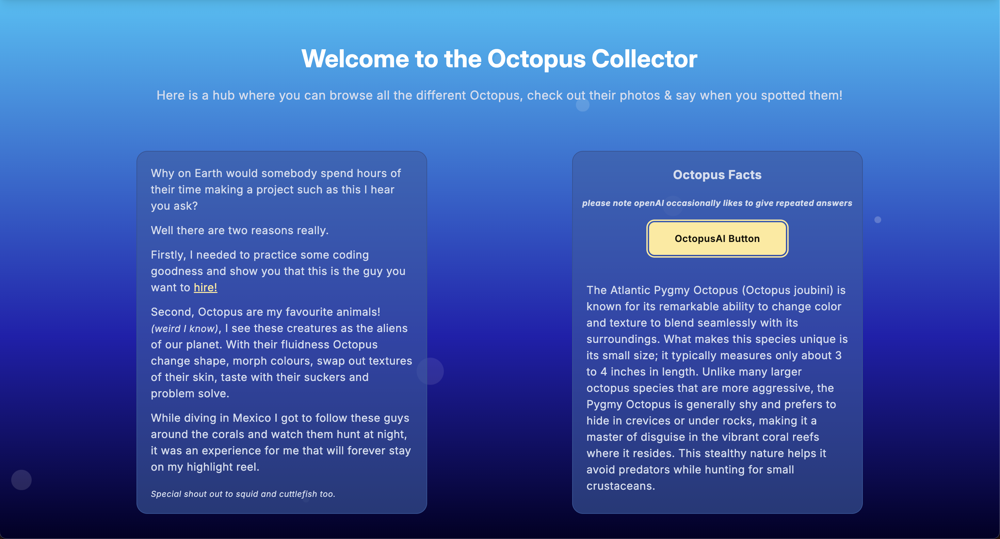
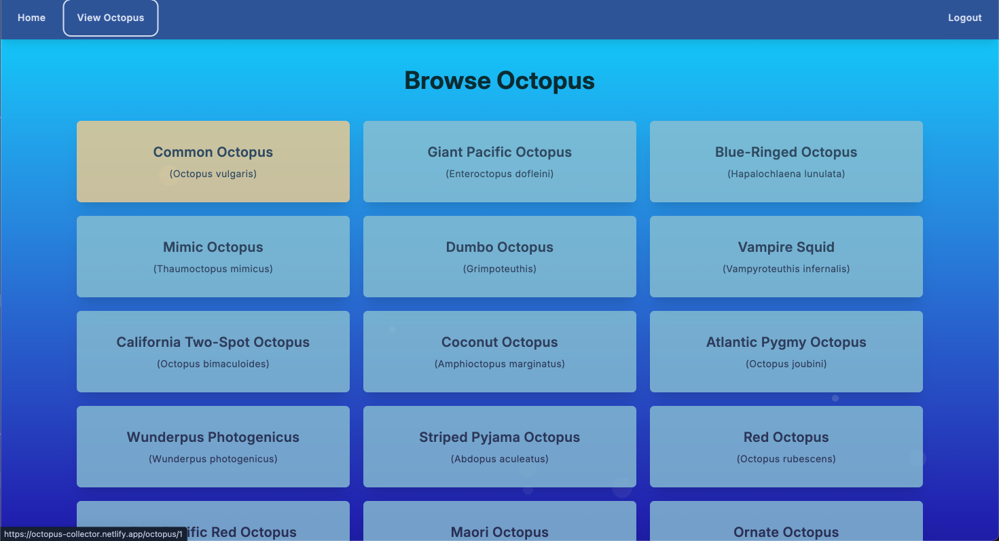
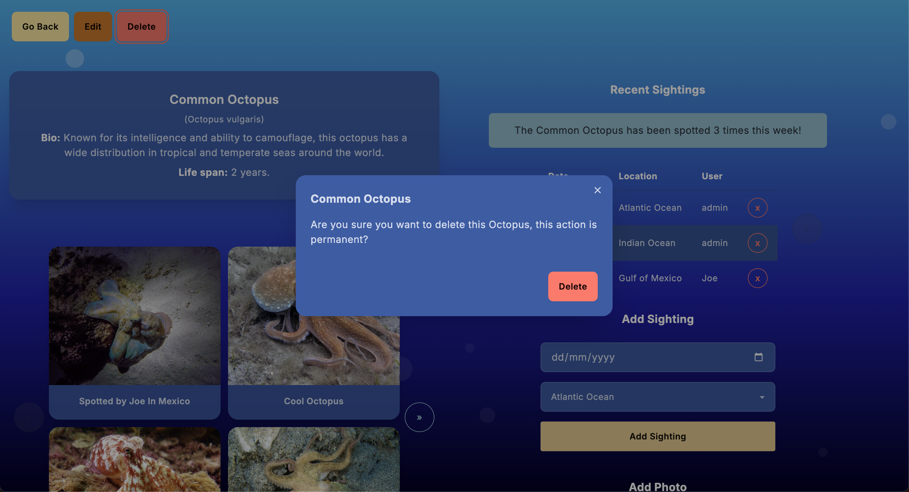
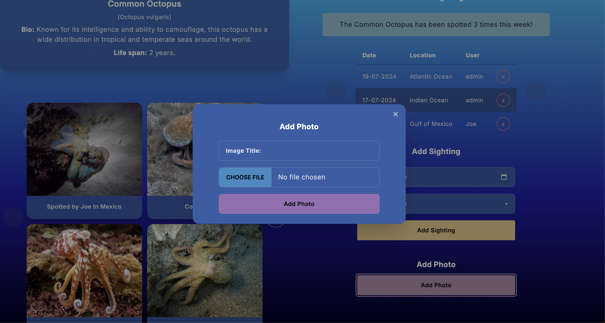
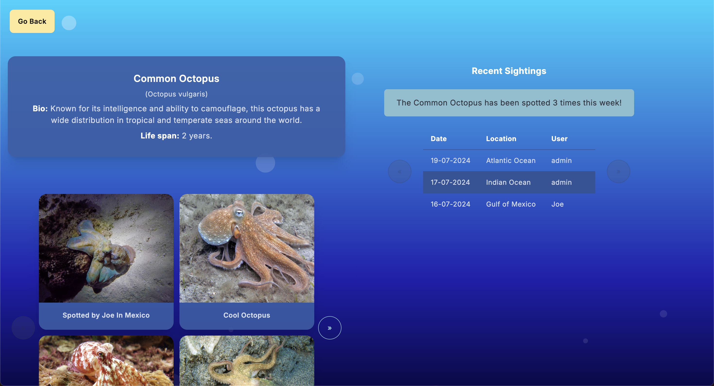
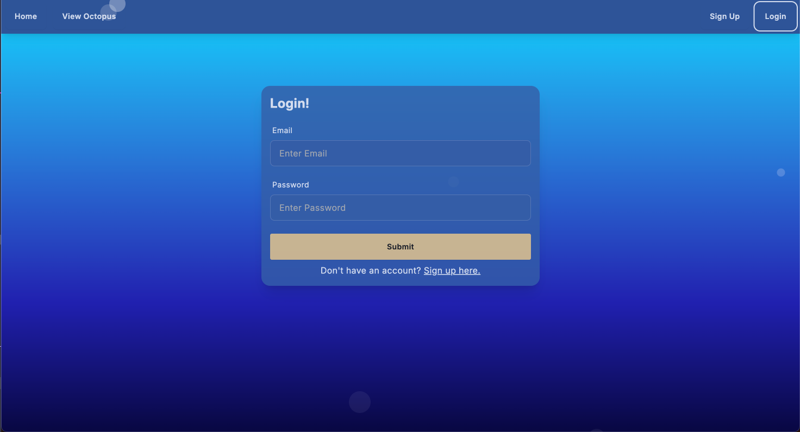

# Octopus Collector
## Overview
Here I have built a fullstack app where you can view some Octopus, add your own images, and say when you last saw one! I did this to refresh myself with Python & Django, React, and to learn AWS s3. 

## Technical Parts
* Created an Django API with a Postgresql Database, which has full CRUD capabiities
* Serving the API on a React frontend powered by Vite
* Created custom authentication 
* Protected destructive behaviours behind authentication and admin users.
* There are some admin specific capabilites too, such as being able to Edit & Delete octopus from the client, they are also able to delete general user sightings and images
* Set up a bucket in AWS so I can store my images in s3
* Threw in the openAI API so a user can entertain themselves with some random octopus facts

## Built with
* Python
* Django
* Django-Rest-Framework
* Postgresql
* Postman
* React
* React-Router-Dom
* Axios
* Tailwindcss
* DaisyUI
* CSS
* OpenAI API
* Git
* Heroku
* Netlify 

## Deployed Version
### [View the deployed version of the app](https://octopus-collector.netlify.app/)

## Key Features
* Fully CRUD app
* Create, Update & Delete functionality locked, so admins/users have to be logged. Users must also be the owner of the item which they are attempting to alter.
* OpenAI Octopus Fact Generator
* AWS s3

## Challenges 
* I often worked on this Project in evenings or when I had a moment spare from the General Assembly Bootcamp which I am a TA on, due to this it was sometimes difficult to find enough time to get the work which I wanted to do each day done.
* Having the relationships in my models correctly link together, so I can make a simple get request for Octopus once & see data from other models too. 
* Implementing sighting_this_week & sighting_this_month, so a user can see the most recent sightings clearly.
* Understanding the nuts and bolts of AWS s3, I used ChatGPT to explain specific parts of how s3 was connected, for example, how did the backend know to send image files to be stored in s3 when it wasn't coded as part of my post request in images/views.py. It was superhelpful to gain and understanding of the process this way.
* Structoring my frontend Octopus show page in a way which wasn't a cognative overload. I really wanted this page to be a one stop shop, no redirecting for adding sightings or images. For this I made good use of pagination, carousels & modals. 
* Getting a hold of what was causing an overflow issue, I checked all elements via the trusty inspect tools and nothing was exceeding any widths. I eventually discovered it was a div in my App.jsx which generates my background bubbles (and some css within) which was causing the issues. 

## Wins & Key Learnings 
* This is my second go at creating this app, initially I had started and then got bogged down with my work. So I was super happy to come back to it, starting from scratch and getting this to where I want it to be. 
* With me going through the problems and solving them, it really helped my ability provide support to with my cohort of students who were building django apps too. 
* Getting AWS s3 alive and kicking is a solid victory. 
* Integrating OpenAI was a bit of a last minute decision, but it's been a while since I used a third party API & well worth the learning. 

## Future Improvements
* For this app something I had been thinking of the past week or so is that having the name of the dive sites where a user has spotted an Octopus would be great
* I really wanted to add my own custom sprite, but realised learning how to do this is another project in itself - so one for the future! For the time being I am using one found online.
* Get a solid group of seed files for this app so it is nicely populated for user experience.

## Screenshots of the app

### Home and Index

### Admin edit & delete

### Any logged in user

### Somebody who is not logged in

### Register and Login

### Resources:

[Octopus PNGs by Vecteezy](https://www.vecteezy.com/free-png/octopus)

[OctoCat and Bubbles by Cody Pearce](https://codepen.io/codypearce/pen/VwYOGzq)